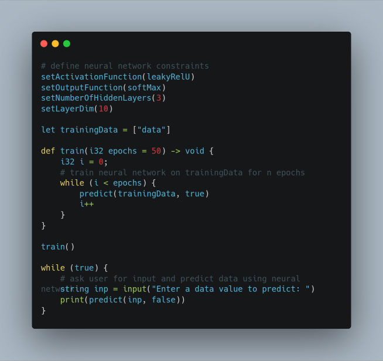
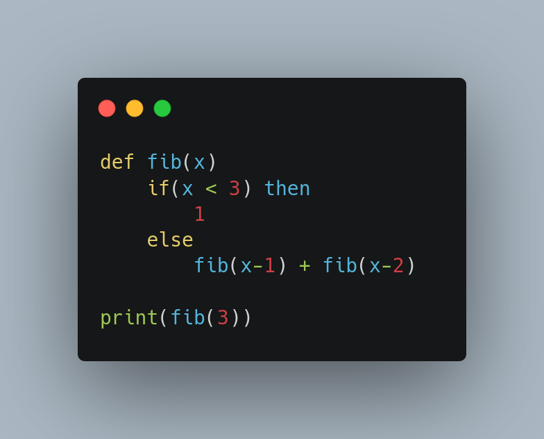
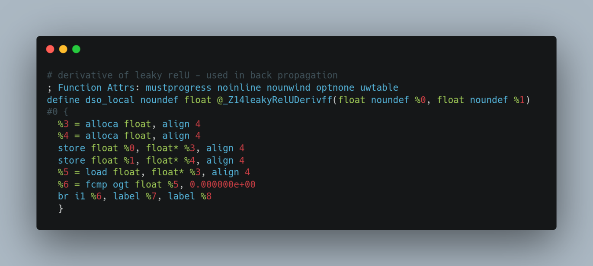

# Neuralang: A Compiled Interoperable Scripting Language Built for Machine Learning

_Neuralang_ is a compiled language with support for interoperability with any LLVM language (i.e. C, C++, Haskell, Rust, etc.) with a focus on machine learning.  _Neuralang_ ships with several features:
* **Interoperability**, removing the need for multiple instances.
* **Typing**, allowing for more readable - flexible code.
* **C-level speeds**, no more bottlenecks due to poorly maintained Python libraries

## Inspiration
Modern day machine learning is all done on python, making not very extendable - good luck trying to have Rust and Python communicate with each other without having two separate processes running.  _Neuralang_ seeks to solve this by making a scripting language built in LLVM (low level virtual machine) - allowing anybody with knowledge in most modern languages to have access to machine learning embedded in _your_ program without the need for creating multiple programs to have concurrent machine learning.

## Interopability

Interopability is achived because of LLVM's IR - or intermediate representation.  By using an LLVM-compatible compiler, such as `clang`, `llvm-rs`, or any other LLVM bindings for that specific language interopability is easy.  The target language's code will be compiled to the IR.  For example the code shown above depicts C-code that has been compiled down to its intermediate representation.  This is then combined with the code compiled in _Neuralang_ to be called from either language!  The standard library for this language was written in C and interop-ed with _Neuralang_ as a proof on concept.

## Challenges we ran into

LLVM's documentation leaves much to be desired in the way of clarity and content. As such, implmenting LLVM was very difficult and took the bulk of the time to get working.

## Accomplishments that we're proud of

We created our own language in 2 days! It has basic functionality and, what we think, is good modern-day high-level syntax. 

## What we learned

We learned how to build our own language interperter that can compile code down to IR. We also learned how to link multiple IR files together, and compile it down to machine code, creating an executable.

## What's next for NeuraLang

Moving forward, we plan to add a lot more functionality. These include quality of live improvements, and new features, like GPU integration, and more predefined classes. Also, hopefully more new features and built-ins to help users.
